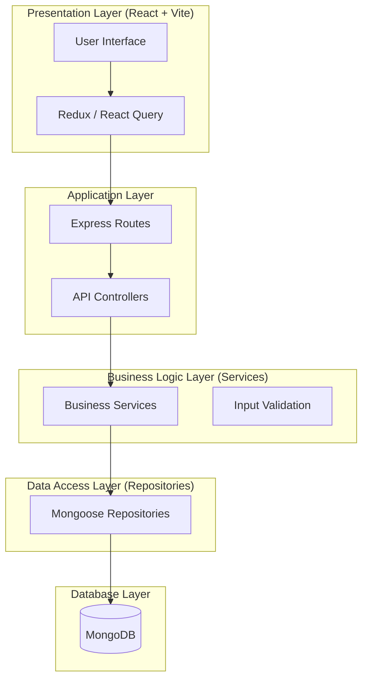
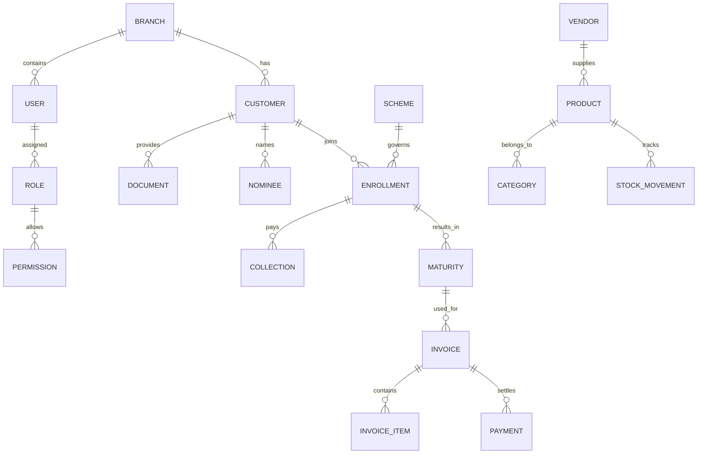

# Phase 1: System Architecture

## 1. High-Level Architecture
The system follows a **Layered Monolith (Clean Architecture)** approach for the backend and a **Modular Flux-based Architecture** for the frontend.

## 2. Frontend Architecture (React)
Path: `src/`

- `app/`: Global providers, store configuration.
- `layouts/`: Shared layouts (Dashboard Layout, Auth Layout).
- `routes/`: Centralized routing logic.
- `modules/`: Feature-sliced modules (e.g., `modules/crm`, `modules/inventory`). Each module has its own `components`, `hooks`, `services`.
- `components/`: UI-Library (Atomic components).
- `services/`: API client configuration.
- `store/`: Global state (Redux slices).

## 3. Backend Architecture (Node/Express)
Path: `src/`

- `config/`: Environment variables, DB connection.
- `controllers/`: Request handling (no business logic here).
- `services/`: Core business logic.
- `repositories/`: Database abstraction/queries.
- `models/`: Mongoose schemas.
- `middlewares/`: Auth, error handling, logging.
- `routes/`: API endpoint definitions.

## 4. Database Schema (ER Diagram)

## 5. Performance & Indexing Strategy
- **Indexes:** Compound indexes on `branchId` + `customerId` for fast lookups. TTL indexes for temporary tokens.
- **Aggregation:** Heavy use of MongoDB Aggregation Pipeline for Reporting.
- **Caching:** Redis (future phase) for gold rates and dashboard stats.
